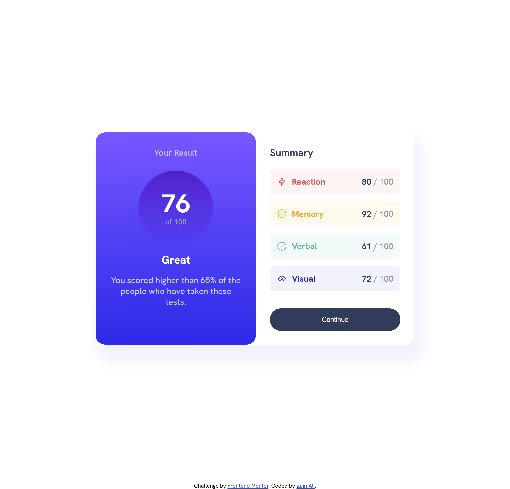
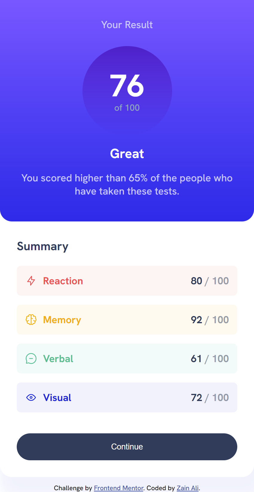

# Frontend Mentor - Results summary component solution

This is a solution to the [Results summary component challenge on Frontend Mentor](https://www.frontendmentor.io/challenges/results-summary-component-CE_K6s0maV). Frontend Mentor challenges help you improve your coding skills by building realistic projects. 

## Table of contents

- [Overview](#overview)
  - [The challenge](#the-challenge)
  - [Screenshot](#screenshot)
  - [Links](#links)
- [My process](#my-process)
  - [Built with](#built-with)
- [Author](#author)

## Overview

### The challenge

Users should be able to:

- View the optimal layout for the interface depending on their device's screen size
- See hover and focus states for all interactive elements on the page
- **Bonus**: Use the local JSON data to dynamically populate the content

### Screenshot

### Links

- Solution URL: [https://github.com/zainali954/Product-preview-card-component](https://github.com/zainali954/Product-preview-card-component)
- Live Site URL: [zainali954.github.io](https://zainali954.github.io/Product-preview-card-component/)

## My process

### Built with

- HTML markup
- CSS custom properties
- Flexbox
- Desktop-first workflow

## Author

- Website - [zainali954.github.io](https://zainali954.github.io/Product-preview-card-component/)
- Frontend Mentor - [@zainali954](https://www.frontendmentor.io/profile/zainali954)

